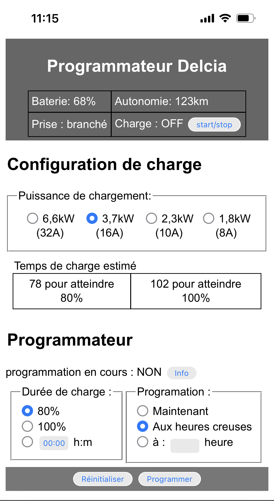

# Delcia
Delcia is a simple web service with UI, designed to be executed locally, which allows you to program the charging of your Dacia or Renault electric car.
The name Delcia is a nod to (D)a(cia) and T(el)sa.

The idea of this development is to complete the functionalities of the DACIA application which does not allow you to program the charging of your car.

Delcia is based on :
- Renault API https://renault-api.readthedocs.io/en/latest/ 
- and Python Crontab https://pypi.org/project/python-crontab/

Delcia can be deployed on device that support cron services and Python, like Raspberry/Ubuntu and Synology/Linux Nas and Docker image provided.


## Disclaimer and warning

This project is not affiliated with, endorsed by, or connected to Renault/Dacia. I accept no responsibility for any consequences, intended or accidental, as a as a result of interacting with Renault’s API using this project.

The server do not implement any security access. The server implemented is attended to run on local network, without internet access.  Do not forward on internet the port used by the server.  

## Functionalities
- Estimate the charging time following the charger type
- Schedule recharges according to the estimated charging time

- 

## Distribution package 
The script 'make_distrution.sh' make a distribution package 'delcia.tar.gz' to prepare installation on systems meet requirements.

## Setup development environment

The development need the following packages (renault-api, python-crontab, ...) . You can install via PIP :  
```
~$ pip install renault-api
~$ pip install python-crontab
~$ pip install flask
~$ pip install asyncio
~$ pip install click
~$ pip install dateparser
~$ pip install tabulate
```


## <a name="config"> </a>Configuration 

### configuration file 
Delcia server use "delcia_conf.json" configuration file to configure the access to your renault account and running parameters.
```
{
  "DACIA_LOGIN":"",
  "DACIA_PASSWORD":"",
  "DACIA_ACCOUNT":"",
  "DACIA_VIN":"",
  "CRONFILE":"/etc/crontabs/root",
  "PORT": 8181,
  "DEBUG": false,
  "USER": "root",
  "ADD_USER_TO_CRON": false
}
```
#### Dacia/Renault configuration
Dacia login and password is your credentials coming from your Dacia / Renault account. VIN is the vehicle identification number that you can find on your gray card.
You can retrieve your Dacia/Renault account through Renault-CLI. On root folder where the project is installed, run following command to see available accounts. 
```
~$ source venv/bin/activate
~$ renault-api accounts 
```

#### System configuration
The file CRONFILE contain entry like : 
```
* * * * * USER script.sh
```
Parameters cronfile, user, add_user_to_cron, depends on your host installation. Installation section defines default values to use on Synology, Linux Ubuntu and Docker.  But depending on your system/installation you can adjust them.
- CRONFILE : define the directory of cronfile to use. By default leave this parameter blank
- USER : define the username field used in the crontab. By default use the user running the webserver process. 
- ADD_USER_TO_CRON : define if we need to force adding the username in cron entry.  By default leave this parameter to FALSE


### off-peak / peak hour
Your off-peak / peak hours can be configured in the Python file: "libs/user_conf.py", in functions get_heure_creuse_midi() and get_heure_creuse_soir().

```
def get_heure_creuse_midi(now):
    now1 = time.gmtime().tm_hour
    now2 = time.localtime().tm_hour
    decalage_horraire = datetime.timedelta(hours=now2 - now1)
    heure_creuse = datetime.datetime(now.year, now.month, now.day, 12, 38, 0) + decalage_horraire
    return heure_creuse , heure_creuse + datetime.timedelta(hours=2)

def get_heure_creuse_soir(now):
    now1 = time.gmtime().tm_hour
    now2 = time.localtime().tm_hour
    decalage_horraire = datetime.timedelta(hours=now2 - now1)
    heure_creuse = datetime.datetime(now.year, now.month, now.day, 1, 38, 0) + decalage_horraire
    return heure_creuse , heure_creuse + datetime.timedelta(hours=5)
```

Here, an example with off-peak hours:
- 2 hours in the morning from 12h38 pm
- 5 hours at night from 1h38 am 

regardless of winter or summer times. The functions (get_heure_creuse_midi/get_heure_creuse_soir) automatically add the time difference.


## Sample of Installation

The following dependencies are needed :
- OS with crond service
- Python 3.x 


### Synology
#### Prerequisite
Python3 can be installed via the Synology DSM Installation Center, but pip and virtualenv are not installed.
##### Install PIP
Here is a short how to on how to install pip
https://jackgruber.github.io/2021-06-27-install-pip-on-synology/ 

Other option : 
Download get-pip.py via curl (instructions from here: https://pip.pypa.io/en/stable/installing/):
```
~$ curl https://bootstrap.pypa.io/get-pip.py -o get-pip.py
```
Then, install pip globally:
```
~$ sudo python3 get-pip.py
```

Then you can install virtualenv. Be sure to use sudo here, as otherwise it will install pip only locally for the user.

```
~$ sudo python3 -m pip install virtualenv
```

#### Install package
Considering you have 'delcia.tar.gz' in your home 
```
~$ cd ~
~$ tar -xvzf delcia.tar.gz
```
A directory 'delcia_distrib' is created. In this directory, run the install script
```
~$ ./install.sh 
```
#### Configure the server
Now you have to configure the file 'delcia_conf.json', concerning cron, use the following parameters/values : 
```
{
  "CRONFILE":"/etc/crontab",
  "DEBUG": false,
  "USER": "root",
  "ADD_USER_TO_CRON": false
}
```
For the other parameters, see section [Configuration](#config)


#### Install service at startup
The distribution is comming with two shellscript :
- delcia_web_deamon.sh
- auto_restart.sh

The installation consiste to use DSM task scheduler to stat 'delcia_web_deamon.sh' at boot, and 'auto_restart.sh' every hour to check delcia server is up and running.
see : 
- (en) https://kb.synology.com/en-uk/DSM/help/DSM/AdminCenter/system_taskscheduler?version=7 
- (fr) https://kb.synology.com/fr-fr/DSM/help/DSM/AdminCenter/system_taskscheduler?version=7

To, start 'delcia_web_deamon.sh' at boot created a triggered task:
- Go to Control Panel > Task Scheduler, click Create, and select Triggered Task.
  - Select User-defined script, then :
    - in tab "General" :
      - enter task name
      - leave 'root' for user.
    - in tab "Task Settings" :
      - in 'User-defined script' enter the full path of the script 'delcia_web_deamon.sh', eg : _/var/services/homes/USER/delcia_distrib/delcia_web_deamon.sh_

Fellowing the same way, for rebustness, you can create a 'scheduled task' every hour with the script _'auto_restart.sh'_ 


### Ubuntu
#### Prerequisite
Install Python3, pip3 and virtualenv, see for example : https://www.digitalocean.com/community/tutorials/how-to-install-python-3-and-set-up-a-programming-environment-on-an-ubuntu-20-04-server-fr 

#### Install package
Considering you have 'delcia.tar.gz' in your home 
```
~$ cd ~
~$ tar -xvzf delcia.tar.gz
```
A directory 'delcia_distrib' is created. In this directory, run the install script
```
~$ ./install.sh 
```
#### Configure the server
Now you have to configure the file 'delcia_conf.json', concerning cron, use the following parameters/values : 
```
{
  "CRONFILE":"",
  "DEBUG": false,
  "USER": "ubuntu",
  "ADD_USER_TO_CRON": false
}
```
For the other parameters, see section [Configuration](#config)

#### Install systemd service

Copy the  service description file 'delcia.service' in '/etc/systemd/system'

Note : You can change before the file 'delcia.service' according your installation : default is '/home/ubuntu/delcia_distrib/' with user ubuntu
```
sudo cp delcia.service /etc/systemd/system/
```
You can test the service with commands :
```
sudo systemctl start delcia
sudo systemctl status delcia
```
and stop and test the service with commands 
```
sudo systemctl stop delcia
sudo systemctl status delcia
```

To enable the service at startup, enter the command :
```
sudo systemctl enable delcia
```

### Docker
A Docker images provided is base on : https://hub.docker.com/_/alpine 
Before building the container, configure the file "delcia_conf_alpine.conf" (see [Configuration](#config))

Concerning cron, use the following parameters/values : 
```
{
  "CRONFILE":"/etc/crontabs/root",
  "DEBUG": false,
  "USER": "root",
  "ADD_USER_TO_CRON": true
}
```

#### Build the Docker images
You can build docker image by command line :
```
~$ docker build --pull --rm -f "Dockerfile_alpine" -t mydelcia:latest "." 
```
#### Test / Run the image 
You can test the image, by running the container :
```
~$ docker run --name delcia  -d  -p 2707:2707 mydelcia 
```
On your host, you can access to container service through the URL : http://127.0.0.1:2727

Note : to auto-start the image, see : https://docs.docker.com/config/containers/start-containers-automatically/

